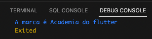

# Geters e Seters

>Usados para passar ou pegar valores de atributos privados dentro da classe <br>

- Get:
  - Dentro da classe ```TipoDoItem get nomeGet => _atributoClassePrivado;```
  - Get obtem o valor de um dos atributos da classe e exibindo ao usuario.
  - Não é possivel fazer atribuição de valor a um atributo usando o get
  - Exemplo completo get: [Get](./Get_Set.md#get)
- Set:
  - Dentro da classe 
    ```dart 
      set nomeSet(String nomeSetParam) { 
        // Regra de negocio e atribuicao do valor para o paramentro privado 
        _nome = nomeSetParam;
      }
    ```
  - Set recebe o valor passado e o repassa para o atibuto da classe, podendo ou nao fazer uma regra para aceitar, recusar ou modificar o valor passado.
  - Set esta passando o valor de seu atributo para o atributo privado da classe
  - Exemplo completo set: [Set](./Get_Set.md#set)


## Passando valor recebido para atributo privado da classe

- Arquivo de invocação

```dart
    void main() {
    var pessoa = Pessoa();
    pessoa.nomeGet = 10;
    print(' A idade é ${pessoa.nomeGet}');
    }
```

- Arquivo de classe

```dart
class Pessoa {
  int? _atributoClassePrivado;

  int? get nomeGet => _atributoClassePrivado;
  
  set nomeGet(int? nomeVariavel) => _atributoClassePrivado = nomeVariavel;
}
```


## Verificando valor recebido antes de atribuir ao privado da classe

>É possivel criar uma regra de negocio nos setes, atribuindo alguma condição para aceitar ou nao o valor passado para o atributo

- Abaixo, nao irá aceitar idades menor que 50

- Arquivo de invocação

```dart
    void main() {
    var pessoa = Pessoa();
    pessoa.nomeGet = 10;
    print(' A idade é ${pessoa.nomeGet}');
    }
```

```dart
    class Pessoa {
    int? _atributoClassePrivado;

    int? get nomeGet =>_atributoClassePrivado;

    set nomeGet(int? nomeVariavel) {
        if (nomeVariavel != null && nomeVariavel < 50) {
        print('Idade baixa');
        throw Exception('Idade baixa');
        } else {
        _atributoClassePrivado = nomeVariavel;
        }
    }
    }
```


## Get
```dart
void main() {
  var camisetaADF = Camiseta(marca: 'Academia do flutter');
  print('A marca é ${camisetaADF.marcaGet}');
}

class Camiseta {
  String _marca;

  // Construtores
  Camiseta({required String marca}) : _marca = marca;

  // Get
  String get marcaGet => _marca; // Get so libera acesso ao conteudo

}
```


## Set
```dart
void main() {
  var camisetaADF = Camiseta(marca: 'Academia do flutter');
  camisetaADF.marcaSet = 'Adidas';
  print('A Marca é ${camisetaADF.marcaGet}');
}

class Camiseta {
  // Caracteristicas - Atributos
  String _marca;

  // Construtores
  Camiseta({required String marca}) : _marca = marca;
  String get marcaGet => _marca;
  // Set
  set marcaSet(String marcaSetParam) {
    // Set faz alteração de um conteudo, podendo haver regras de negocio para aceitar/recusar/modificar o valor passado
    if (marcaSetParam == 'ADF') {
      _marca = 'Academia do flutter';
    } else {
      _marca = marcaSetParam;
    }
  }
}
```

