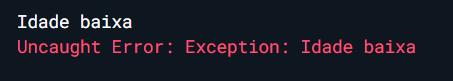

# Geters e Seters

>Usados para passar ou pegar valores de atributos privados dentro da classe <br>

- Get:
  - Dentro da classe ```Tipo get nomeGet => _atributoClassePrivado;```
  - Get esta pegando o atributo da classe e retornando ele para o set
- Set:
  - Set esta passando o valor de seu atributo para o atributo privado da classe
  - Dentro da classe ```set nomeGet(Tipo nomeVariavel) => _atributoClassePrivado = nomeVariavel;;```

## Passando valor recebido para atributo privado da classe

- Arquivo de invocação

```dart
    void main() {
    var pessoa = Pessoa();
    pessoa.nomeGet = 10;
    print(' A idade é ${pessoa.nomeGet}');
    }
```

- Arquivo de classe

```dart
class Pessoa {
  int? _atributoClassePrivado;

  int? get nomeGet => _atributoClassePrivado;
  
  set nomeGet(int? nomeVariavel) => _atributoClassePrivado = nomeVariavel;
}
```


## Verificando valor recebido antes de atribuir ao privado da classe

>É possivel criar uma regra de negocio nos setes, atribuindo alguma condição para aceitar ou nao o valor passado para o atributo

- Abaixo, nao irá aceitar idades menor que 50

- Arquivo de invocação

```dart
    void main() {
    var pessoa = Pessoa();
    pessoa.nomeGet = 10;
    print(' A idade é ${pessoa.nomeGet}');
    }
```

```dart
    class Pessoa {
    int? _atributoClassePrivado;

    int? get nomeGet =>_atributoClassePrivado;

    set nomeGet(int? nomeVariavel) {
        if (nomeVariavel != null && nomeVariavel < 50) {
        print('Idade baixa');
        throw Exception('Idade baixa');
        } else {
        _atributoClassePrivado = nomeVariavel;
        }
    }
    }
```


