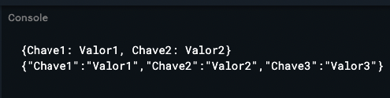

# Json
- Definição de um json
- É uma String em formato de [map](Maps.md)
- Possui chave e valor ambos tipados com String, e sao normalmente usados em retornos de APIs/Banco de dados
> Exemplo de um Json
```dart
String json = '{"Chave1":"Valor1","Chave2":"Valor2"}'
```
> Decodificando um json
- Para decodificar um json usa-se o pacote ```converter```
- Apos decodificar o json se torna um [Mapa](./Maps.md) e deve ser tratado como tal.
```dart
import 'dart:convert';
void main() {
  String mapa = '{"Chave1":"Valor1","Chave2":"Valor2"}';
 
  var json = jsonDecode(mapa);
  print(json);
}
```


> Codificando um Json
- Para decodificar um json usa-se o pacote ```converter```
- Para atualizar um valor de um json é necessario converte-lo em mapa e fazer a atualização do mesmo, apos atualizar o mapa, uma nova conversão é feita para assim obter o json atualizado.
```dart
import 'dart:convert';
void main() {
  String mapa = '{"Chave1":"Valor1","Chave2":"Valor2"}';
 
  var json = jsonDecode(mapa);
  print(json);
  
  json['Chave3'] = 'Valor3';
  
  mapa = jsonEncode(json);
  print(mapa);
}
```



