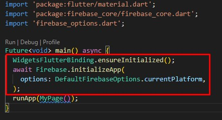
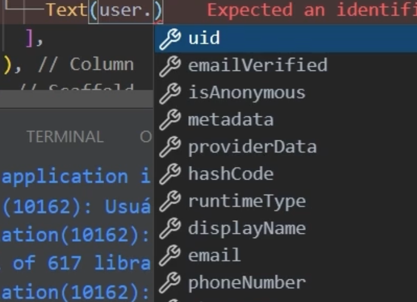

# FirebaseAuth
- [Auth Manual](./auth_manual.md)
- [Auth CLI](./auth_cli.md)
## Documentação
- [FlutterFire](https://firebase.flutter.dev/)
## Uso

- Importar dependencias no arquivo pubspec.yaml
  - Ou no terminal do app rodar ```flutter pub add firebase_auth```
  - Rodar no terminal do app ```flutter pub add firebase_core```
  - Rodar no terminal do app ```flutter run```
    - Apos toda configuração do flutter run usar crtl + c para parar programa
## Configuração para efetuar cadastro (E-mail e Senha)
- Colocar no main, antes do runApp pois o firebase precisa ser iniciado antes do app
    - 
- Usando um [TextFormField](../../../../Flutter/Widgets/Forms.md)
    - Configure seus controllers para receber o email e senha do usuario
    - Configura botao para chamar a funcao de cadastro
- Exemplo de função que realizará cadastro no firebase
```dart
Future<void>cadastroUser()async{
    final cadastro = await FirebaseAuth.instance.createUserWithEmailAndPassword(
        email: <TextFieldControllerEmail>.text,
        password:<TextFielControllerSenha>.text
    );
    cadastro.user?.sendEmailVerification(); // Verificação de email valido
}
```
- Se nao ocorrer erros siga para o projeto, caso ocorra refaça o todo processo, ou veja documentação
- Tipos de erros de autenticação [aqui](https://firebase.google.com/docs/auth/admin/errors?hl=pt-br)

## Configuração para efetuar login (Email e Senha)
- Usando um [TextFormField](../../../../Flutter/Widgets/Forms.md)
    - Configure seus controllers para receber o email e senha do usuario
    - Configura botao para chamar a funcao de cadastro
- Exemplo de função que realizará cadastro no firebase
```dart
Future<void>LoginUser()async{
    final credencial = await FirebaseAuth.instance.signInWithEmailAndPassword(
        email: <TextFieldControllerEmail>.text,
        password:<TextFielControllerSenha>.text
    );
    final user = cretencial.user;
    if(user != null && !user.emailVerified){
        // Acão apos verificar que usuario nao esta com email verificado
    }else{
        // Ação apos validação de usuario
    }
}
```
## Configurando verificação de usuario logado
- No ```initState(){}``` da aplicação chamar função do firebase
```dart
void initState(){
    FirebaseAuth.instance.authSateChanges().listen((User? user){
        print(user != null); // exibe true ou false
    });
}
```
-   Isto ficara "escutando" ações dentro do firebase
## Recebendo dados do usuario logado
- No ```State``` daa aplicação definir uma variavel do tipo ```User?``` que pertence ao pacote do firebase.
    - Em seguida popular esta variavel na inicialização do aplicativo.
```dart
User? user;
void initState(){
    user = FirebaseAuth.instance.currentUser;
}
```
- Feita a atribução a variavel user é possivel obter dados do usuario como instancia da variavel.\


## Fazendo logout do usuario
- Dentro de um ```onPressed``` ou onde desejar chame a funcao do Firebase para efetuar logout.
```dart
Firebase.instance.signOut();
```
