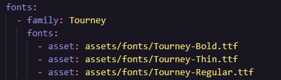

# Flutter

- Fundamentos (Acesse [Fundamentos DART](../Dart/Fundamentos.md) )

## Configuração de inicialização do app

>Desabilitar backup automático ANDROID

- Dentro da pasta Android no aplicativo navegue para:
  - app -> src -> main -> AndroidManifest.xml
- Na tag <application incluir linhas com:
  - android:allowBackup="false"
  - android:fullBackupOnly="false"

>Permitir que o emulador acesse sites "nao seguros"

- Dentro da pasta Android no aplicativo navegue para:
    -   app -> src -> debug -> AndroidManifest.xml

- Na tag <manifest xmlns:android... :
        -   ```
            <application android:usesCleartextTraffic="true">
            <!-- possibly other elements -->
            </application>
         ```
- Dentro da pasta Android no aplicativo navegue para:
  - app -> src -> main -> AndroidManifest.xml
- Na tag <application incluir linhas com:
  - android:usesCleartextTraffic="true"

>Verificar .yaml para utilizar:

- Assets (Imagens, arquivos)
  - Adiciona a pasta assets tag assets do .yaml para acessar todos, ou adiciona um a um com seu caminho relativo completo (assets/) ou (/assets/image.jpg):
  - 
  - Adiciona a pasta assets tag fonts do .yaml, na tag deve informar a famila da fonte, e na sua identação o caminho asset onde foi instalada (compatível com formatos .ttf e .otf)
    - Também é possivel efetuar a instalação do pacote [google fonts](https://pub.dev/packages/google_fonts):
    - 
- Dependencias (Pacotes terceiros) [Pub.Dev](https://pub.dev)

## Tipos basicos widgets

- StatelessWidget
  - É uma extenção de classes -> *class Nome extends StatelessWidget*
  - Obrigatório criar o metodo biuld context
    ```dart
    @override
    Widget build(BuildContext context) {
        return WidgetQueDesejaRetornar(); // Normalmente um Material() ou Scaffold()
    }
    ```
  - É um componente estático, nao sofre alterações de estado
  - Aceita variaveis em seu corpo
  - Ciclo de vida StatelessWidget:
    - Construor
    - [Build](./Fundamentos.md#buildcontext)
- StatefulWidget
  - É uma extensão de classes -> *class Nome extends StatefulWidget*
  - Dentro desta classe é obrigatório criar método createState
    ```dart
        @override
        State<StatefulWidget> createState() {
            return _ClassCriadaPrivada();
        }
      ```
    - OU
    ```dart
      @override
      _NomeDaClasse createState() => _NomeDaClasseState();
      ```
  - É um componente que pode sofrer alterações de estado
  - Uma nova classe criada como privada, esta classe ira estender State passando a class que extender o StatefulWidget como tipo
    ```dart
        class _ClassCriadaPrivada extends State<Nome> {}
      ```
    - Aceita variaveis em seu corpo
    - Dentro desta classe é obrigatório o método biuld
    ```dart
        @override
        Widget build(BuildContext context) {
            return WidgetQueDesejaRetornar();
        }
      ```
    - Ciclo de vida StatefulWidget
      - Construtor
      - CreateState
        - State ```<StatefulWidget>```
        - Construtor
        - InitState
        - DidChangeDependecies
        - Build
      - SetState
        - Build

## Iniciando carregamento de dados na tela

- initState(){}
  - É um metódo que é chamado sempre que o aplicativo é inicado
  - Dentro deste metodo nao pode ser invocada outra funcao ou navegação pois ira provocar um erro devido a pagina nao esta completamente carregada.
  - Para fazer o processo aguardar conclusão do builder usar-se o WidgetsBinding/addPostFrameCallback
    ```dart
        WidgetsBinding.instance?.addPostFrameCallback((timeStamp){'O que deseja fazer apos pagina completar carregamento}
      ```
## Iniciando descarregamento de dados na tela
- dispose(){}
  - É um metódo que é chamado sempre que o aplicativo é fechado
  - Dentro deste metodos se passa as funcoes que foram passadas no inisState afim de encerra-las ao fechar a aplicação, poupando assim o uso de memoria nos dispositivos
    ```dart
        WidgetsBinding.instance?.addPostFrameCallback((timeStamp){'O que deseja fazer apos pagina completar carregamento}
      ```