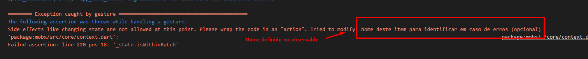

# MobX Models
- Guia inicial [aqui](../../Dependencias/MobX.md)
- Pacote responsável por:
  - Receber valores atualizaveis
  - Notificar atualização de conteudo a tela
  - Informar ação que foi realizada para atualizar conteudo

Documentação oficial Português 
<br>[](https://github.com/mobxjs/mobx.dart/blob/master/translation/pt-BR/README.md)

## Utilização
>MobX é baseado em 3 pilares
- [Observador](./MobX_Modelo.md#observable)
- [Ação](./MobX_Modelo.md#action)
  - [Ação em tela](./MobX_Modelo.md#observer)
- [Reação](./MobX_Modelo.md#reactions)
***
OS DADOS ABAIXO SAO USADOS DENTRO DE UMA CLASSE COMUM
***
### Observable
- É a classe do mobx responsável por observar se o valor/conteudo foi alterado
- Pode ou nao ser tipada, assim como pode ou nao receber uma tag *name* que pode facilitar em caso de erros encontrar o observador que esta com problemas
```dart
var _contador = Observable<int>(0, name: 'Nome deste item para identificar em caso de erros (opcional)');
```
- Exemplo de erro que identifica pelo nome do observador
  - 
### Action
- É a classe do mobx responsável por ações que realizam atualizações em um valor/conteudo
- Normalmente iniciada como *late* pois a ação pode ser iniciada posteriormente, nao juntamente com a classe pai.
- Abaixo exemplo de ação tomada, sempre que a ação é chamada invoca a funcao ```addMaisUmFuncao``` e adiciona +1 ao valor atual da variavel *_contador*
- Iniciando ação
```dart
late Action contadorMaisUm;
```
- Função que ira chamar a ação a ser tomada e passa o co conteúdo para classe *Action*
```dart
ContadorController() {
    contadorMaisUm = Action(addMaisUmFuncao);
  }
```
- Função passada para *Action* executar
```dart
void addMaisUmFuncao() {
    contadorMaisUm.value++;
    }
```
#### Observer
- É a classe do mobx reponsavel por reagir as ações tomadas
- Esta classe recebe a tag builder que recebe uma nova funcao onde seu retorno é o widget a ser atualizado conforme ações tomada.
- Exemplo abaixo mostra um ```Text()``` que seu conteudo é a variavel *contador* e sempre que uma ação é realizada nesta variavel o conteudo do *Text* muda pois o mesmo esta reagindo a ação realizada.
- OBS: Uma variavel que estancia a classe controladora onde possui a ação foi criada ```final controller = ContadorController();``` na pagina onde o ```Observer``` esta sendo usado
```dart
Observer(builder: (_) {
              return Text('${controller.contadorMaisUm}');
            }),
```
### Reactions
- Reações são usadas em [StatefullWidgets](../Fundamentos.md#tipos-basicos-widgets)
- É necessario uma variavel que sera uma lista do tipo ```ReactionDisposer```, esta variavel sera responsavel por fazer os [dispose](../Fundamentos.md#iniciando-descarregamento-de-dados-na-tela) das reacoes da aplicação.
```dart
final reactionsDisposer = <ReactionDisposer>[];
```
- As reações sao em [initState](../Fundamentos.md#iniciando-carregamento-de-dados-na-tela) como variaveis
>1 - autorun
- Reação que recebe uma funcao onde em seu corpo tera o conteudo a ser executado
- Esta reação é chamada sempre ao iniciar a tela e quando um dos observadores em seu corpo sofrer alguma atualização
```dart
final autoDispose = autorun((_) {
  print(controller.contadormaisum);
});
```
- Necessario fazer adicionar variavel de reacao a lista de disposer do tipo ```ReactionDisposer``` ainda dentro do initState
```dart
reactionsDisposer.add(whenDispose);
```
>2 - reaction
- Reação que recebe duas funcoes onde uma retorna o observador que deseja e outra recebe um paramentro que ira assumir o valor do observador e em seu corpo executar alguma reacão
- Esta reacao é executada somente quando o observador retornado pela primera funcao sofrer alterações
```dart
final reactionDispose = reaction((_) => controller.contadormaisum, (contadormaisum) {
  print(contadormaisum);
});
```
- Necessario fazer adicionar variavel de reacao a lista de disposer do tipo ```ReactionDisposer``` ainda dentro do initState
```dart
reactionsDisposer.add(reactionDispose);
```
>3 - when
- Reação que recebe duas funcoes onde uma retorna o observador assim como a reaction, porem uma condição deve ser passada para o resutado seja true ou false, e outra recebe um paramentro que ira assumir o valor do observador e em seu corpo executar alguma reacão
- Esta reacao é executada uma unica vez quando a condição no retorno da primeira funcao é atendida, exemplo abaixo so sera executado quando o contador for maior que 2.
```dart
final whenDispose = when((_) => controller.contadormaisum > 2, () {
  print(controller.contadormaisum);
});
```
- Necessario fazer adicionar variavel de reacao a lista de disposer do tipo ```ReactionDisposer``` ainda dentro do initState
```dart
reactionsDisposer.add(whenDispose);
```

***
Observações: quanto ao dispose deve-se efetuar um forEach na lista para "matar" os itens iniciados no initState
```dart
void dispose() {
  super.dispose();
  reactionsDisposer.forEach((reacaoes) => reacaoes()); // dispose da lista de reactions
}
  ```

**Modelo completo** *[aqui](../Principais/mobx/contador_mobx/)*