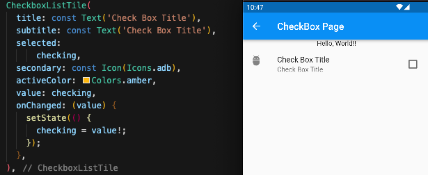
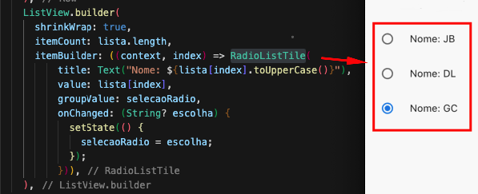
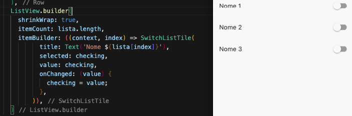

# Tela dinamica, com rolagem

## SingleChildScrollView
- Usado para rolegem dos itens na tela evitando que "estourem" o limite da tela
- Compoe:
    - child: Recebe widget
    - scrollDirection: Axis.direcao scroll (padrao vertical)
---
## ListView
- Usado empilhar os itens em formato de lista evitando assim que "estourem" o limite da tela
- Compoe:
    - children: Recebe uma lista de widgets
## ListTile
- Usado para itens de lista
- Compoe:
    -   title: Recebe widget de texto par titulo
    -   subtitle: Recebe widget de texto com subtitulo
    -   leading: Recebe um widget para lado esquedo
    -   trailing: Recebe um widget para lado direito
## ListView.builder()
- Usado para empilhar itens de um contexto, carregando-os conforme a necessidade
- Compoe:
    - shrinkWrap: Recebe bool (ate o momento usado somente para erro de hasSize)
    - itemCount: Recebe a quantidade de itens que tera na lista
    - itemBuilder: Recebe uma funcao anonima de (context, index){} onde seu retorno é um widget com conteudo da lista, como um [CheckBoxListTile](./Scroll_List.md#checkboxlisttile) ou um [ListTile](./Scroll_List.md#listtile) ou ainda um [RadioListTile](./Scroll_List.md#radiolisttile)
## ListView.separated
- Usado para empilhar itens de um contexto, carregando-os conforme a necessidade
- Compoe:
    - separatorBuilder: Recebe uma funcao anonima de (context, index){} onde seu retorno é um [divisor](./WidgetsTree.md#divider) ou qualquer outro widget que sirva para separar os itens, [CheckBoxListTile](./Scroll_List.md#checkboxlisttile) ou ainda um [RadioListTile](./Scroll_List.md#radiolisttile) por exemplo.
    - itemCount: Recebe a quantidade de itens que tera na lista
    - itemBuilder: Recebe uma funcao anonima de (context, index){} onde seu retorno é um widget com conteudo da lista, como um [CheckBoxListTile](./Scroll_List.md#checkboxlisttile) ou ainda um [RadioListTile](./Scroll_List.md#radiolisttile) ou um [ListTitle](./Scroll_List.md#listtitle)
## ListBody
- Usado para empilhar itens em listas (um abaixo d outro)
- Compoe:
    - children: Recebe uma lista de widgets que ira compor seu conteudo empilhado
    - reverse: Recebe true ou false para determinar a ordem dos itens na lista

## CheckboxListTile
- Usado para itens de lista
- Exemplo:  
    - 
- Compoe:
    - title: Recebe widget de texto par titulo
    - subtitle: Recebe widget de texto com subtitulo
    - selected: Recebe true ou false, que para dados do titulo e subtitulo.
        - Exemplo: caso true, a cor passada no activeColor tera efeito tambem nos textos.
    - secondary: Recebe widget que fica posicionado a equeda,
    - activeColor: Recebe Colors, que determina acor do box ao ser ativado,
    - value: Valor do box (true ou false),
    - onChanged: Função com paramentro referente ao value , ativado sempre que    - selecionado o box   

## RadioListTile
- Usado para itens de lista
- Exemplo:  
    - 
- Compoe:
  - value: Recebe qualquer tipo, porem este tipo deve ser o mesmo do paramentro em onChanged
  - groupValue: Recebe a variavel que ira armazenar o valor
  - onChanged: Função com paramentro referente ao value , ativado sempre que selecionado o radio
  - title: Recebe widget de texto par titulo
  - subtitle: Recebe widget de texto com subtitulo
  - selected: Recebe true ou false, que para dados do titulo e subtitulo.
    - Exemplo: caso true, a cor passada no activeColor tera efeito tambem nos textos.
  - secondary: Recebe widget que fica posicionado a equeda,
  - activeColor: Recebe Colors, que determina acor do box ao ser ativado, 

## SwitchListTile
- Usado para itens de lista
- Exemplo:  
    - 
- Compoe:
    - title: Recebe widget de texto par titulo
    - subtitle: Recebe widget de texto com subtitulo
    - selected: Recebe true ou false, que para dados do titulo e subtitulo.
        - Exemplo: caso true, a cor passada no activeColor tera efeito tambem nos textos.
    - secondary: Recebe widget que fica posicionado a equeda,
    - activeColor: Recebe Colors, que determina acor do box ao ser ativado,
    - value: Valor do box (true ou false),
    - onChanged: Função com paramentro referente ao value , ativado sempre que    - selecionado o togle 

