# Widgets diversos

## Composição do corpo nos aplicativos

- [Documentação](https://docs.flutter.dev/reference/widgets)
- Widgets em sua maioria *filhos e netos* do [Scaffold](../Principais/Scaffold.md)
- Modelos usados sao para Android, para IOS usar [Cupertino](https://docs.flutter.dev/development/ui/widgets/cupertino)

## SizedBox()

- Usado para dar espaçamento entre widgets
- Compoe:
  - height: Recebe altura
  - width: Recebe largura

## Center()

- Todo conteudo deste widget fica centralizado na tela
- Recebe um unico filho
  - child: Widget

## Container()

- Conteiner representa uma caixa que pode conter um ou varios conteudos
- Compoe:
  - width: Largura do container, caso nao seja definica ele tomara todo espaço disponivel
  - height: Altura do container, caso nao seja definica ele tomara todo espaço disponivel
  - color: Cor do container
  - margin: Recebe um valor em [EdgeInserts](./WidgetsTree.md#edgeinsets) para definir as margens,
  - padding: Recebe um valor em [EdgeInserts](./WidgetsTree.md#edgeinsets) para definir as padding,
  - decoration: Quando usado a opção color do widget nao ira mais funcionar pois este parametro tem sua propria definição de cor, Usado com [BoxDecoration](./WidgetsTree.md#boxdecoration)
  - child: Recebe o widget filho para composição
  - OBS: É possivel adicionar um Container dentro do outro

## IntrinsicHeight() / IntrinsicWidth()

- Passa para seus filhos o tamanho necessario para conter seus dados, um para altura, outro para largura
- Compoe:
  - child: Recebe widget que ira ter somente o tamanho necessario para seus dados

## Expanded()

- Passa para seus filhos o tamanho restante disponivel da tela para assim ocupar este espaço
- Compoe:
  - child: Recebe widget que ira ocupar todo espaço restante na tela.

## Rows() & Columns()

- Rows
  - Organiza seus filhos em linhas da esqueda para direitra
  - Compoe:
    - children: Recebe uma lista de outros widgets
    - crossAxisAlignment: Recebe CrossAxisAlignment... ira organizar os filhos na coluna
      - CrossAxisAlignment.center = No meio da coluna
      - CrossAxisAlignment.start = Top da coluna
      - CrossAxisAlignment.end = Fim da coluna
      - CrossAxisAlignment.spaceAround = Da um espacamento entre os itens da coluna seu topo e seu final baseado no espaço total dela
      - CrossAxisAlignment.spaceEvenly = Da um espacamento entre os itens da coluna seu topo e seu final baseado no espaço total dela, espaço igual.
      - CrossAxisAlignment.spaceBetween = Da um espacamento igual entre os itens da coluna.
    - mainAxisAlignment: Recebe MainAxisAlignment... ira organizar os filhos na coluna
      - MainAxisAlignment.center = No meio da linha coluna
      - MainAxisAlignment.start = Direita da linha da coluna
      - MainAxisAlignment.end = Esquerda da linha da coluna
- Columns
  - Organiza seus filhos em colunas de cima para baixo
  - Compoe:
    - children: Recebe uma lista de outros widgets
    - mainAxisAlignment: Recebe MainAxisAlignment... ira organizar os filhos na coluna
      - MainAxisAlignment.center = No meio da coluna
      - MainAxisAlignment.start = Top da coluna
      - MainAxisAlignment.end = Fim da coluna
      - MainAxisAlignment.spaceAround = Da um espacamento entre os itens da coluna seu topo e seu final baseado no espaço total dela
      - MainAxisAlignment.spaceEvenly = Da um espacamento entre os itens da coluna seu topo e seu final baseado no espaço total dela, espaço igual.
      - MainAxisAlignment.spaceBetween = Da um espacamento igual entre os itens da coluna.
    - crossAxisAlignment: Recebe CrossAxisAlignment... ira organizar os filhos na coluna
      - CrossAxisAlignment.center = No meio da linha coluna
      - CrossAxisAlignment.start = Direita da linha da coluna
      - CrossAxisAlignment.end = Esquerda da linha da coluna
    - mainAxisSize: Recebe tamanho maximo e minimo que a coluna ocupará
      - MainAxisSize.min = Tamanho minimo,
      - MainAxisSize.max = Tamanho maximo,
## Wrap
- Possui as mesmas caracteristas de uma Row, porem ao chegar no limite da tela ira fazer uma quebra de linha para caber os widgets filhos.
- Compoe:
  - direction: Axis.vertical,
  - children: []
- Exemplo: 

  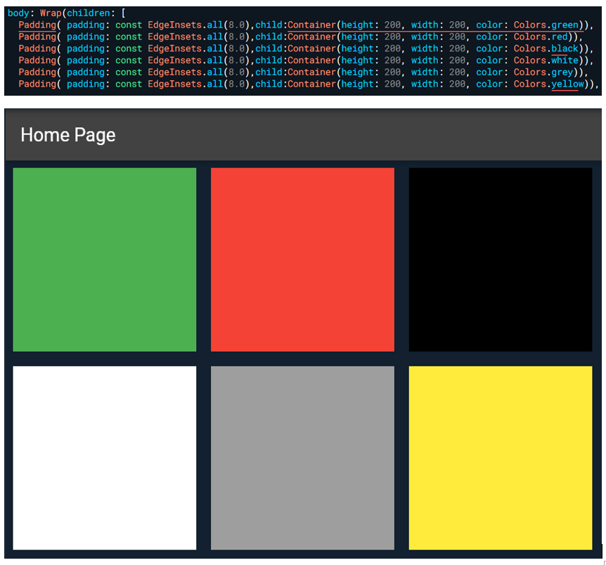

## Buttons

- TextButton()
- Compoe:
  - onPressed: Recebe uma função de ação ao clicar (){}
  - child: Recebe widget de texto ou icone para exibir dentro do botao,
  - style: Formatação do texto, recebe um [TextButton.styleFrom()](./WidgetsTree.md#textbuttonstylefrom) ou [ButtonStyle](./WidgetsTree.md#ButtonStyle)
- ElevatedButton()
- Compoe:
  - onPressed: Recebe uma função de ação ao clicar (){}
  - child: Recebe widget de texto ou icone para exibir dentro do botao,
  - style: Formatação do texto, recebe um [ElevatedButton.styleFrom()](./WidgetsTree.md#elevatedbuttonstylefrom)) ou [ButtonStyle](./WidgetsTree.md#ButtonStyle)
- ElevatedButton.icon()
- Compoe:
  - onPressed: Recebe uma função de ação ao clicar (){}
  - Recebe um widget de [icone](WidgetsTree.md#Icons)
  - label: Recebe widget de texto,
- FloatingActionButton()
- Compoe:
  - onPressed: Recebe uma função de ação ao clicar (){}
  - tooltip: Recebe texto a ser exebido ou parar mouse ou longpress
  - backgroundColor: Receber Colors para definir cor do botao,
  - foregroundColor: Tecebe Colors para definir cor do icone no botao,
  - shape: Recebe OutlinedBorder ou filhos para formatação diversas
  - child: Recebe widget de texto ou icone para exibir dentro do botao
- IconButton()
- Compoe:
  - onPressed: Recebe uma função de ação ao clicar (){}
  - icon: Recebe um widget de [icone](WidgetsTree.md#Icons)
- InkWell()
- Compoe:
  - onTap: Recebe uma função de ação ao clicar (){}
  - child: Recebe widget de texto,
  - borderRadius: Recebe [BorderRadius](./WidgetsTree.md#BorderRadius)
- GestureDetector()
- Compoe:
  - child: Recebe widget de texto,
  - onTap: Recebe uma função de ação ao clicar (){}
  - ao fazer algo: Recebe uma funcao que execulta uma ação ao fazer algo (onHorizontalDragStart, onVerticalDragStart, etc...)
- floatingActionButton : Este botão encontra-se dentro da [Scaffold](../Principais/Scaffold.md)

## Text()

- Usado para definir strings na aplicação
- Compoe:
  - *Conteudo String*
  - style: Recebe um [TextStyle](./WidgetsTree.md#textstyle)

## RotatedBox()

- Faz a rotação de outro widget
- Compoe:
  - quarterTurns: Recebe o valor da rodação (negativo esquerda, positivo direira)
  - child: Recebe o widget que sera rotacionado.

## SnackBar()

- Usado para mensagens rápidas na tela, pode ou não conter interações com o usuário.
- Dentro do `onPressed` ou similar, invocamos a Snackbar e enviamos seu conteúdo para o `ScaffoldMessenger`.
- Declara-se uma variável que recebe `SnackBar()` <= A Snackbar pode ser passada diretamente como parâmetro do `.showSnackBar`.
- Por padrão, as Snackbars são fixas. Para alterar isso, adicione a propriedade `behavior`.
  - Quando a Snackbar está fixa, a propriedade `width` não funciona.
  - Comportamento simples: 
  - context: Conteúdo da Snackbar.
- Comportamento de ação: 
  - context: Conteúdo da Snackbar.
  - action: Recebe `SnackBarAction` que compõe:
    - label: Texto exibido (string solta sem uso de `Text()`).
    - onPressed: Função anônima de ação ao ser clicada.
- Comportamento completo: 
  - context: Conteúdo da Snackbar, aceita widgets.
  - action: Recebe `SnackBarAction` que compõe:
    - label: Texto exibido (string solta sem uso de `Text()`).
    - onPressed: Função anônima de ação ao ser clicada.
    - duration: Recebe um [Duration](./WidgetsTree.md#duration).
    - padding: Recebe [EdgeInsets](./WidgetsTree.md#edgeinsets).
    - behavior: Recebe `SnackBarBehavior.floating`.
    - width: Largura da Snackbar.
    - shape: Recebe [RoundedRectangleBorder](./WidgetsTree.md#roundedrectangleborder).
- Invoca-se o *`ScaffoldMessenger.of(context).showSnackBar(snackbar);`*
  - Passa como parâmetro do `.of` o [context](../Fundamentos.md#buildcontext).
  - Passa como parâmetro do `.showSnackBar` a variável que a contém.

## Stack()

- Usado para posicionar widgets nos locais desejados.
- O Stack não alinha os widgets um ao lado do outro ou um abaixo do outro; ele sobrepõe um ao outro. Cabe ao usuário definir uma posição para cada widget dentro do Stack.
- Composição:
  - children: Recebe um ou mais widgets.
    - Os widgets são empilhados um sobre o outro.
    - Para definir a posição de cada widget, usa-se o [Align](./WidgetsTree.md#align) ou [Positioned](./WidgetsTree.md#positioned) como pai.
      - Stack => Align => Widget

## IndexedStack()

- Usado para posicionar widgets um sobre o outro, exibindo um por vez de acordo com o índice passado.
- Composição:
  - index: Recebe o índice de um dos itens da lista a ser exibido (padrão é 0).
  - children: Recebe um ou mais widgets que serão exibidos de acordo com seu índice.

## Card()

- Sua exibição ao usuário é similar ao [Container](./WidgetGeral.md#container).
- Composição:
  - elevation: Recebe o valor da sombra do card.
  -

 shape: Recebe [RoundedRectangleBorder](./WidgetsTree.md#roundedrectangleborder).
  - child: Recebe um widget.

## BottomNavigationBar()

- Usado para exibir botões na barra inferior da página.
- Para navegação ou troca de widget na tela:
  - É necessária uma lista de itens a serem exibidos ou executados para cada botão na barra.
    - Cada item possui um índice na lista.
  - É necessária uma variável int para ser o índice dos itens na lista -> ```int _indiceAtual = 0;```
  - É necessária uma função que irá receber o índice atual e passar o valor para a variável.
  - Exemplo: 
    
  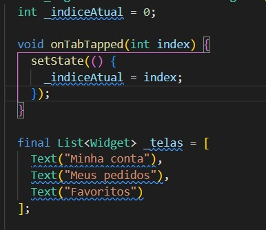
  - Composição:
    - items: Recebe uma lista de [BottomNavigationBarItem](./WidgetsTree.md#bottomnavigationbaritem). ***É necessário ter 2 ou mais itens na lista.***
    - onTap: Recebe o índice do botão clicado, passando-o para outra função que irá executar uma ação de acordo com o valor do índice.
    - currentIndex: Recebe a variável.
    - Exemplo: 
    
  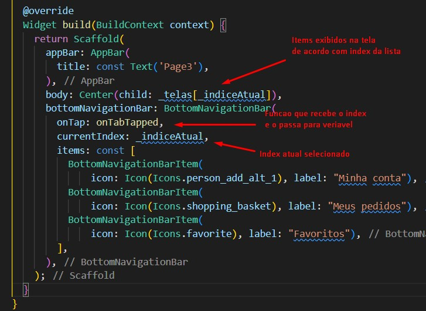
- Para ações na tela:
  - É necessária uma função para receber o índice do onTap.
  - É necessário um comparador, como o `switch case`, para executar algo de acordo com o índice recebido.
  - Exemplo: 
  
  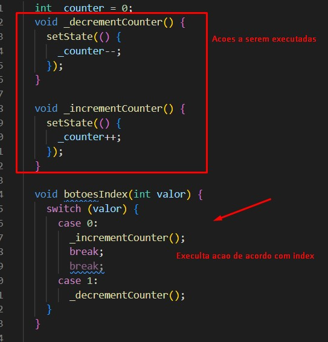
  - Composição:
    - items: Recebe uma lista de [BottomNavigationBarItem](./WidgetsTree.md#bottomnavigationbaritem).
    - onTap: Recebe o índice do botão clicado, passando-o para outra função que irá executar uma ação de acordo com o valor do índice.
    - Exemplo: [Clique aqui](../../Img/listaItems4.jpg)

## MaterialBanner

- Possui a mesma estrutura da [SnackBar](./WidgetGeral.md#snackbar).
- Invoca-se o *`ScaffoldMessenger.of(context).showMaterialBanner(materialBanner);`*
- Ocultar o *`ScaffoldMessenger.of(context).hideCurrentMaterialBanner();`*
  - Passa como parâmetro do `.of` o [context](../Fundamentos.md#buildcontext).
  - Passa como parâmetro do `.showMaterialBanner` a variável que contém o MaterialBanner().
- Composição:
  - actions: Recebe uma lista de ações (por exemplo, botões) - *Obrigatório*.
  - content: Recebe o conteúdo a ser exibido no banner.
  - backgroundColor: Recebe uma cor.
  - forceActionsBelow: Recebe true ou false para determinar se os botões de ação ficam na parte debaixo do banner ou não (padrão é false).

Os banners não desaparecem automaticamente da tela após serem exibidos. Essa ação deve ser feita por um botão de ação dentro das actions.

## Visibility

- Usado para exibir um widget se uma condição for atendida (similar ao `if`).
- Composição:
  - visible: Condição a ser atendida.
  - child: Widget que será exibido se a condição for verdadeira.

## CheckBox

- Caixa de seleção que executa alg

uma ação ao ser selecionada.
  - Para conseguir marcar e desmarcar o box, é necessário usar uma variável no `value` e alterar o valor dela no `onChanged` (com algum gerenciador de estado, como `setState`), para atualizar o estado do check na tela.
- Exemplo: <br>
  - 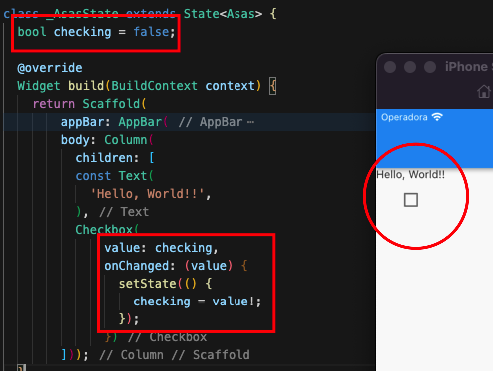<br><br>
- Exemplo 2: <br>
  - 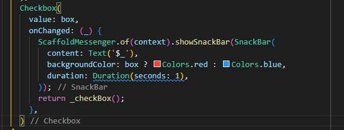<br>
- Composição:
  - onChanged: Função com um parâmetro referente ao `value`, ativado sempre que o box é selecionado.
  - value: Valor selecionado (true ou false).

## Radio

- Usado para selecionar um valor na página.
- Independentemente de quantos radios existam na página, apenas 1 é selecionado, desde que os valores de `value` sejam diferentes.
- Exemplo: <br>
  - 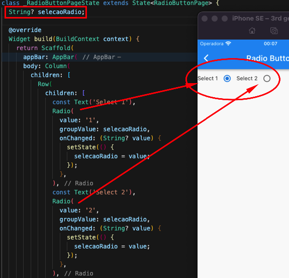
- Composição:
  - value: Recebe qualquer tipo, mas esse tipo deve ser o mesmo do parâmetro em `onChanged`.
  - groupValue: Recebe a variável que irá armazenar o valor selecionado.
  - onChanged: Função com um parâmetro referente ao `value`, ativada sempre que um radio é selecionado.

## Switch (Toggle)

- Toggle de seleção que executa alguma ação ao ser selecionado (mesmas características do CheckBox).
  - Para conseguir ativar e desativar o switch, é necessário usar uma variável no `value` e alterar o valor dela no `onChanged` (com algum gerenciador de estado, como `setState`), para atualizar o estado na tela.
- Exemplo: <br>
  - 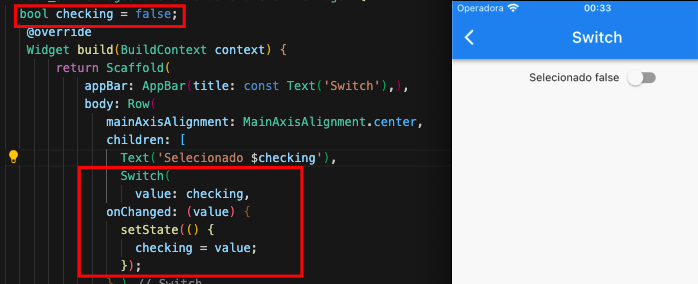<br>
- Composição:
  - onChanged: Função com um parâmetro referente ao `value`, ativada sempre que o switch é selecionado.
  - value: Valor selecionado (true ou false).

## LinearProgressIndicator

- Barra de progresso interativa.
- O valor total da barra padrão é 1.0 (se o valor da tag `value` for 0.5, metade da barra será preenchida).
- Composição:
  - backgroundColor: Cor que representa o progresso faltante.
  - valueColor: ```AlwaysStoppedAnimation<Color>(Colors.black)```, que é a cor do progresso concluído.
  - value: Recebe o valor final passado como parâmetro.
- Exemplo 1: 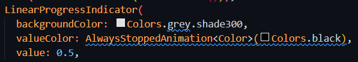
- Para ter animação no preenchimento da barra, usa-se o [TweenAnimationBuilder](./WidgetsTree.md#tweenanimationbuilder).
- Exemplo 2: 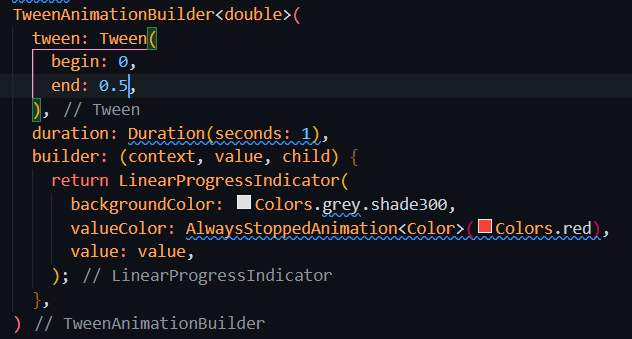

## Dismissible

- Ação de deslizar um item de uma lista para uma direção pré-definida e executar uma função após o deslize.
- Composição:
  - background: Recebe um widget que é exibido ao arrastar um item da lista.
  - direction: Recebe `DismissDirection.DIREÇÃO`, que determina a direção do deslize.
  - confirmDismiss: Recebe uma função com um parâmetro *(DismissDirection direction)*, onde seu retorno deve ser uma confirmação de true ou false, como um [pop-up](./Dialogs.md#

alert-dialog) para confirmar a ação.

## Drawer

- Usado para exibir um menu lateral (como uma gaveta) em uma página.
- Composição:
  - child: Recebe um widget que será exibido dentro do Drawer.

## AlertDialog

- Usado para exibir um diálogo/modal ao usuário com opções ou informações.
- Composição:
  - title: Título do diálogo.
  - content: Conteúdo do diálogo.
  - actions: Lista de ações/opções do diálogo.

## BottomSheet

- Usado para exibir um painel inferior na tela.
- É possível personalizar o conteúdo do BottomSheet com qualquer widget.
- Composição:
  - builder: Recebe uma função que retorna o conteúdo do BottomSheet, geralmente um widget.
  - elevation: Recebe o valor da sombra do painel (padrão é 0.0).
  - shape: Recebe a forma do painel.
  - backgroundColor: Cor de fundo do painel.

## SingleChildScrollView

- Usado para criar uma área deslizável que contém um único filho.
- Permite que o conteúdo seja rolado verticalmente quando não há espaço suficiente para exibi-lo completamente.
- Composição:
  - child: Recebe um único widget que será exibido dentro do SingleChildScrollView.

Espero que essas informações sejam úteis para você! Se tiver mais alguma dúvida, estou aqui para ajudar.

## Slider

- Um controle deslizante usado para capturar um valor fornecido pelo usuário.
- Recebe valores do tipo double e requer uma variável para armazenar o valor selecionado, além de um gerenciador de estado, como o setState, para atualizá-lo.
- Exemplo: <br>
  -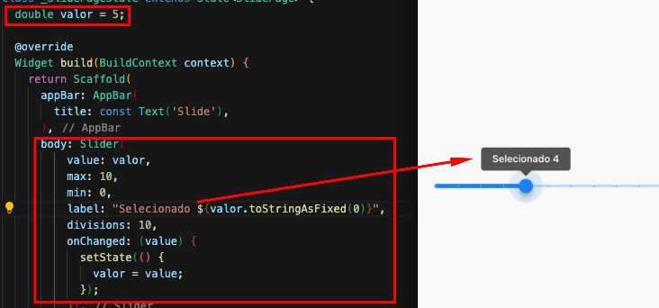
- Composição:
  - value: Valor inicial do controle deslizante.
  - max: Valor máximo do controle deslizante.
  - min: Valor mínimo do controle deslizante.
  - label: Recebe uma String para exibição durante o deslizamento, utilizado em conjunto com divisions.
  - divisions: Recebe um valor inteiro que define o número de divisões no controle deslizante.
  - onChanged: Uma função com um parâmetro que representa o novo valor selecionado quando o controle deslizante é movido.
