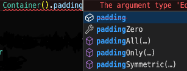

# Extensões de Margem e Preenchimento do GetX
- É uma extensão usada para determinar valores de margem e preenchimento para widgets.



> Método de uso para margem:
```dart
// Para manter o widget sem margem
Container().marginZero,
```
```dart
// Para determinar uma margem para todos os lados do widget
Container().marginAll(20).
```
```dart
// Para determinar uma margem para locais específicos do widget
Container().marginOnly(left: 0.0, top: 0.0, right: 0.0, bottom: 0.0)
```
```dart
// Para determinar uma margem em uma das direções do widget
Container()..marginSymmetric(vertical: 0, horizontal: 0)
```
> Método de uso para preenchimento:
```dart
// Para manter o widget sem preenchimento
Container().paddingZero,
```
```dart
// Para determinar um preenchimento para todos os lados do widget
Container().paddingAll(20).
```
```dart
// Para determinar um preenchimento para locais específicos do widget
Container().paddingOnly(left: 0.0, top: 0.0, right: 0.0, bottom: 0.0)
```
```dart
// Para determinar um preenchimento em uma das direções do widget
Container()..paddingSymmetric(vertical: 0, horizontal: 0)
```
