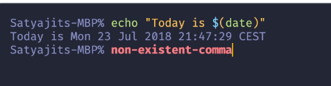

# Instalação plugins para mac
- Executar apos configuração de ambiente


***
## Instalações
- [zsh](./Plugins.md#zsh)
- [Oh My Zsh](./Plugins.md#oh-my-zsh)
- [zsh-syntax-highlighting](./Plugins.md#zsh-syntax-highlighting)
- [zsh-autosuggestions](./Plugins.md#zsh-autosuggestions)
***
## Zsh
- Instalação
    ```
    brew install zsh
    ```
- Definir como padrão
    ```
    chsh -s /usr/local/bin/zsh
    ```
## Oh My Zsh
- Instalação
    ```
    sh -c "$(curl -fsSL https://raw.githubusercontent.com/ohmyzsh/ohmyzsh/master/tools/install.sh)"
    ```
- Fechar terminal para gravar altterações
## zsh-syntax-highlighting
- Instalação
    ```
    git clone https://github.com/zsh-users/zsh-syntax-highlighting.git ~/.oh-my-zsh/custom/plugins/zsh-syntax-highlighting
    ```
- Configuração
    - Abrir arquivo ./zshrc (local onde esta as variaveis de ambiente)
    - Procurar plugins = (...)
    - Colocar dentro do parenteses `zsh-syntax-highlighting`
    - Terminal ficara com comandos coloridos 
    - 
## zsh-autosuggestions
- Instalação
    ```
    git clone https://github.com/zsh-users/zsh-autosuggestions ~/.oh-my-zsh/custom/plugins/zsh-autosuggestions
    ```
- Configuração
    - Abrir arquivo ./zshrc (local onde esta as variaveis de ambiente)
    - Procurar plugins = (...)
    - Colocar dentro do parenteses `zsh-autosuggestions`
    - Terminal tera auto sugestoes de comandos
    - 


